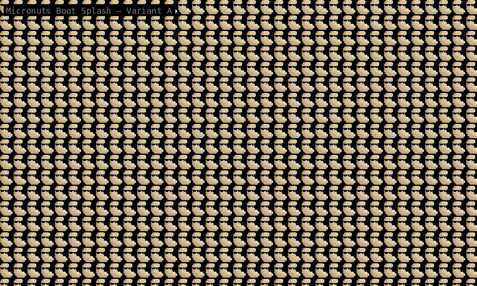

# Micronuts

**Cashu Hardware Wallet** for the STM32F469I-Discovery board.

Micronuts is an experimental hardware wallet for [Cashu](https://github.com/cashubtc/nuts) ecash tokens running on bare metal. It scans Cashu QR codes, performs blind signature operations, and communicates with a host mint via USB CDC.

## Status: Working Prototype

The firmware builds, flashes, and runs on real hardware. All core Cashu operations (blind, sign, unblind) have been verified on the STM32F469I-Discovery board. A **native SDL2 simulator** lets you develop and test the UI on your PC without flashing.

### Boot Splash Preview



*Retro tiled Cashu nut logo grid with alternating row scrolling. See [docs/BOOT-SPLASH.md](docs/BOOT-SPLASH.md) for details.*

## What Works

- **Native simulator** — SDL2 window renders the 800x480 display on your PC, mouse clicks map to touch input. Develop without flashing.
- **Boot splash animation** — retro tiled Cashu nut logo grid with alternating row scrolling, 3 cycling variants, touch to exit
- **4" DSI display** (800x480, NT35510) — renders token info, scan results, status messages via SDRAM framebuffer + LTDC
- **QR code scanning** — GM65 module on USART6, auto-baud detection (9600/57600/115200), continuous polling
- **USB CDC protocol** — binary command/response protocol over USB OTG FS (VID:PID `16c0:27dd`, "Micronuts / Cashu Hardware Wallet")
- **Cashu blind signature flow** — import token, generate blinded outputs, receive signatures, unblind, produce proofs
- **Hardware RNG** — STM32F469 analog ring oscillator peripheral for cryptographically random blinder generation
- **Crypto** — secp256k1 (k256), SHA-256, hash-to-curve, CBOR V4 token parsing

## Target Hardware

- **Board**: STM32F469I-Discovery (STM32F469NIH6 MCU)
- **MCU**: ARM Cortex-M4F @ 180MHz, 2MB Flash, 384KB SRAM
- **Display**: 4" DSI LCD (NT35510/OTM8009A, 800x480)
- **Touch**: FT6X06 capacitive touch controller — used for boot splash exit, touch visualization
- **QR Scanner**: GM65 module via USART6 (PG14=TX, PG9=RX through shield-lite adapter)
- **Storage**: 16MB SDRAM + microSD via SDIO (SDIO not yet used)
- **USB**: USB OTG FS (CDC-ACM for host communication)
- **RNG**: Hardware random number generator (analog ring oscillators)

## Architecture

```
┌──────────────────────────────────────────────────────────────┐
│  HOST PC                                                     │
│  ┌────────────────────────────────────────────────────────┐  │
│  │  host-mint-tool: holds mint key, signs blinded msgs   │  │
│  └──────────────────────┬─────────────────────────────────┘  │
│                         │ USB CDC                            │
└─────────────────────────│────────────────────────────────────┘
                          │
┌─────────────────────────│────────────────────────────────────┐
│  STM32F469I-DISCOVERY   ▼                                    │
│  ┌────────────────────────────────────────────────────────┐  │
│  │  micronuts-app/ (shared core)                          │  │
│  │  ├─ protocol.rs       — USB CDC command/response codec │  │
│  │  ├─ display.rs        — embedded-graphics rendering    │  │
│  │  ├─ command_handler.rs — all handle_* functions        │  │
│  │  ├─ state.rs          — FirmwareState, SwapState       │  │
│  │  ├─ qr/              — GM65 scanner + decoder         │  │
│  │  └─ hardware.rs       — MicronutsHardware trait        │  │
│  └────────────────────────────────────────────────────────┘  │
│                                                               │
│  firmware/ (hardware adapter)                                 │
│  ├─ main.rs           — HAL init, USB, display, scanner      │
│  └─ hardware_impl.rs  — impl MicronutsHardware for STM32     │
│                                                               │
│  cashu-core-lite/ — V4 CBOR, secp256k1, hash-to-curve       │
│  host-mint-tool/   — CLI demo mint signer                    │
└───────────────────────────────────────────────────────────────┘

  ┌────────────────────────────────────────────────────────┐
  │  NATIVE SIMULATOR (same micronuts-app, different HW)   │
  │                                                        │
  │  examples/native_sim.rs                                │
  │  ├─ Sdl2Display    — DrawTarget → SDL2 texture (800x480)│
  │  └─ MockHardware   — impl MicronutsHardware (stdin/stdout)│
  └────────────────────────────────────────────────────────┘
```

## Project Structure

```
micronuts/
├── Cargo.toml              # Workspace definition
├── micronuts-app/          # Platform-independent business logic
│   ├── src/
│   │   ├── lib.rs          — Entry point: pub fn run()
│   │   ├── hardware.rs     — MicronutsHardware trait
│   │   ├── protocol.rs     — USB CDC command/response codec + tests
│   │   ├── display.rs      — Rendering (generic over DrawTarget)
│   │   ├── command_handler.rs — All handle_* functions
│   │   ├── state.rs        — FirmwareState, SwapState, ScannerInfo
│   │   ├── qr/             — GM65 scanner + decoder
│   │   └── util.rs         — Hex codec, demo key derivation
│   └── examples/
│       └── native_sim.rs   — SDL2 window simulator with mock hardware
├── firmware/               # Embedded app for STM32F469I-Discovery
│   ├── Cargo.toml
│   ├── build.rs            # Copies memory.x to OUT_DIR for linker
│   ├── memory.x            # STM32F469 memory layout (2048K flash, 320K RAM)
│   ├── assets/             # Vendored logo and generated tile assets
│   └── src/
│       ├── main.rs         # Hardware init, boot splash, delegates to micronuts-app
│       ├── hardware_impl.rs # impl MicronutsHardware for STM32 peripherals
│       ├── boot_splash.rs  # Retro boot splash animation engine
│       ├── boot_splash_assets.rs  # Generated RGB565 tile data
│       ├── usb.rs          # USB CDC binary protocol
│       └── lib.rs          # Module declarations
├── cashu-core-lite/        # Minimal Cashu library (no_std + alloc)
├── host-mint-tool/         # Demo mint signer CLI for host PC
├── scripts/
│   ├── generate_assets.py  # Offline tile asset generation
│   └── render_preview.py   # Host-side splash preview renderer
└── docs/
    ├── ARCHITECTURE.md
    ├── BOOT-SPLASH.md      # Boot splash documentation
    ├── DEMO-FLOW.md
    ├── QR-SCANNER.md
    ├── QR-SCANNER-DESIGN.md
    └── GM65-PROTOCOL-FINDINGS.md
```

## Pinned Dependencies

All git dependencies are pinned to specific commits for reproducibility:

| Crate | Pin | Why |
|-------|-----|-----|
| `stm32f469i-disc` | `a412876` | Sync BSP with `rng` feature. Based on `fa6dc86` (working display/SDRAM/SDIO/USB). Upstream `main` diverged to a different HAL version. |
| `stm32f4xx-hal` | `789e5e86` | Pinned by BSP. DSI, SDRAM, SDIO, USB FS, RNG for STM32F469. |
| `gm65-scanner` | `5b1cf56` | Post-merge main with async+sync dual-mode driver, HIL-tested on hardware. |

Other deps from crates.io: `k256`, `sha2`, `rand_core 0.6`, `minicbor`, `embedded-graphics`, `defmt 1.0`.

## USB CDC Protocol

Binary protocol: `[Cmd:1][Len:2][Payload:N]` / `[Status:1][Len:2][Payload:N]`

| Command | Code | Description |
|---------|------|-------------|
| ImportToken | 0x01 | Send V4 token |
| GetTokenInfo | 0x02 | Request summary |
| GetBlinded | 0x03 | Request blinded outputs |
| SendSignatures | 0x04 | Send blind signatures |
| GetProofs | 0x05 | Request unblinded proofs |
| ScannerStatus | 0x10 | QR scanner connection status |
| ScannerTrigger | 0x11 | Trigger QR scan |
| ScannerData | 0x12 | Read last scanned data |

## Quick Start

### Option A: Native Simulator (SDL2)

Develop and test the UI on your PC without hardware. Opens an 800x480 window that renders exactly what the LCD would show. Mouse clicks map to touch input.

```bash
# Install SDL2 development libraries
sudo apt install libsdl2-dev

# Run the simulator (requires an X11 or Wayland display)
cargo run -p micronuts-app --example native_sim --features std
```

Requirements: Rust, SDL2 dev libraries, an X11 or Wayland display server. No cross-compiler or probe needed.

**Headless / SSH / no display?** Start a virtual framebuffer first:

```bash
# Start Xvfb (virtual X11 server)
sudo apt install xvfb
Xvfb :1 -screen 0 800x480x24 &

# Run the simulator against the virtual display
DISPLAY=:1 cargo run -p micronuts-app --example native_sim --features std
```

**NVIDIA GPU note:** The simulator auto-detects NVIDIA GPUs, probes the default SDL2 driver, and automatically falls back to `SDL_VIDEODRIVER=software` if it crashes (SIGSEGV). If the software driver is unavailable (some distro packages don't include it), use Xvfb instead. Set `SDL_VIDEODRIVER` yourself to override auto-detection. See [#4](https://github.com/Amperstrand/micronuts/issues/4).

### Option B: Flash to Device (STM32F469I-Discovery)

Build the firmware and flash it to the STM32F469I-Discovery board via ST-Link.

```bash
# Install ARM target and probe-rs
rustup target add thumbv7em-none-eabihf
cargo install probe-rs-tools

# Build (from workspace root)
cargo build --release

# Flash and run with RTT output
probe-rs run --chip STM32F469NIHx target/thumbv7em-none-eabihf/release/firmware

# Flash only (no RTT)
probe-rs download --chip STM32F469NIHx target/thumbv7em-none-eabihf/release/firmware
```

### Run Tests

```bash
# Unit tests for protocol codec, hex utils, etc.
cargo test -p micronuts-app
```

## Known Issues

- **RNG security audit pending** — The hardware RNG works but needs independent entropy quality verification. See [#1](https://github.com/Amperstrand/micronuts/issues/1).
- **NVIDIA GPU SIGSEGV** — SDL2 may crash on NVIDIA GPUs. The simulator auto-detects this and falls back to `SDL_VIDEODRIVER=software`, but some distro SDL2 packages don't include the software driver. In that case, use `Xvfb` as a virtual display instead. See [#4](https://github.com/Amperstrand/micronuts/issues/4).
- **Touch screen** — FT6X06 used for boot splash exit; not yet wired into full UI navigation.
- **SDIO unused** — microSD slot works in the BSP but firmware doesn't use it yet.
- **Demo mint only** — `host-mint-tool` is a toy signer, not a real Cashu mint.

## Roadmap & Future Ideas

What should this device become? Here are possible directions, roughly ordered from near-term to speculative.

### 1. Cashu QR Debug / Showcase Tool

**The simplest next step.** Scan any Cashu QR code and display a structured breakdown: token version, keyset IDs, proof counts, amounts, memo fields, lock conditions. Great for developers testing mint integrations and for conference demos.

- Parse and display all Cashu V4 token fields on the LCD
- Classify QR payloads: Cashu token, Cashu URL, P2PK lock, multisig, time-lock
- Show decoded `P2PKsH` and `P2PK` lock scripts in human-readable form
- Add a "token health check" — flag malformed proofs, unknown keysets, suspicious amounts
- Touch UI for navigating between scanned tokens

### 2. Offline POS Device

**Scan-to-pay for ecash.** The device scans a Cashu payment QR (a token the customer is sending), verifies the proofs are well-formed, displays the amount, and the merchant confirms on the touch screen. The actual mint verification would require the device to talk to a mint — see use case 5 for connectivity options.

- Touch-screen "Confirm Payment" / "Reject" flow
- Display payment amount and unit (SAT, msat, USD)
- Store confirmed tokens in SDRAM or microSD for later batch-send to mint
- Multi-denomination support (show breakdown of proof amounts)
- Transaction log stored on microSD (CSV or CBOR)

### 3. P2PK & Lock Debug Tool

**Decode and verify lock-to-public-key outputs.** Cashu supports locking proofs to public keys (P2PK, P2PKsH). This tool would decode lock scripts, verify signatures against known pubkeys, and display lock conditions. Essential for developers building P2PK workflows.

- Decode `P2PK` and `P2PKsH` lock scripts from proof fields
- Verify proof signatures against specified public keys on-device
- Display lock conditions: which pubkey, timelocks, spending conditions
- Test P2PK spending by signing unlock messages with the device's own key
- Useful for debugging multisig and HTLC-like Cashu workflows

### 4. JavaCard Secure Element Integration (Satocash)

**This is the most interesting hardware direction.** The [Satocash applet](https://github.com/Toporin/Satocash-Applet) is an open-source JavaCard implementation of a Cashu wallet. JavaCard applets run on secure elements — tamper-resistant chips designed to protect cryptographic keys even against physical attacks.

The STM32F469I-DISCO has a microSD slot connected via SDIO. [Secure microSD cards](https://www.swissbit.com/index.php?option=com_content&view=article&id=293&Itemid=601) (like the Swissbit PS-100u) exist that combine flash storage with a JavaCard-capable secure element on the same card. You can load the Satocash applet onto such a card, insert it into the Discovery board's microSD slot, and talk to it via APDU commands over the SDIO interface.

**How it would work:**

1. Load Satocash applet onto a compatible secure microSD card using [GlobalPlatformPro](https://github.com/martinpaljak/GlobalPlatformPro)
2. Insert the card into the STM32F469I-DISCO's microSD slot
3. Firmware communicates with the card via APDU commands over SDIO (the BSP already has SDIO support)
4. The JavaCard holds all wallet private keys — they never leave the secure element
5. The STM32 provides the user interface (display, touch, QR scanner, USB) and sends signing requests to the card
6. The card signs transactions inside its secure boundary and returns only signatures

**What Satocash provides:**
- Secp256k1 key management (import, derive, sign)
- PIN-based access control (4-16 char PIN, lockout after failed attempts)
- Authentikey for card authentication
- PIN-less payments with configurable amount thresholds (v0.1-0.3)
- Proof export/import for Cashu operations
- BIP32-like key derivation (via parent Satochip applet)

**What we'd need to build:**
- A Rust APDU transport layer over SDIO (the `stm32f469i-disc` BSP has SDIO support, but we'd need the smartcard protocol layer on top — send SELECT, send CLA/INS/P1/P2/Lc/Data/Le, parse response SW1/SW2)
- Port the relevant subset of [pysatochip](https://github.com/Toporin/pysatochip) APDU logic to Rust
- Integrate the secure element into the blind signature flow: instead of the firmware holding keys, it delegates signing to the card
- Handle PIN entry via the touch screen

**Why this matters:** It moves private keys out of the STM32's flash (which is readable by anyone with a debugger) and into a proper secure element. The JavaCard is designed to resist physical attacks — key extraction requires expensive equipment and expertise. This is the difference between "proof of concept" and "something you could actually trust with money."

**Compatible hardware:**
- Swissbit PS-100u VE card (secure microSD with JavaCard 3.0.1 support)
- NXP JCOP J2D081
- J3D081 JCOP v2.4.2 R2 (available single-piece from Motechno)

**References:**
- [Satocash Applet](https://github.com/Toporin/Satocash-Applet) — Cashu wallet JavaCard applet
- [Satochip Applet](https://github.com/Toporin/SatochipApplet) — Parent Bitcoin hardware wallet applet (BIP32/BIP39)
- [pysatochip](https://github.com/Toporin/pysatochip) — Python client library (reference for APDU protocol)
- [GlobalPlatformPro](https://github.com/martinpaljak/GlobalPlatformPro) — Tool for loading applets onto cards

### 5. Network-Connected Wallet

**The device currently can't talk to mints.** All mint interaction goes through the host PC over USB. Adding direct network connectivity would make it a standalone wallet.

Options for connectivity:
- **USB Ethernet dongle** — The STM32F469 has a MAC peripheral, but the Discovery board doesn't expose an Ethernet PHY. A USB-to-Ethernet adapter via the USB OTG port could work (the USB host stack would need to be implemented).
- **WiFi shield** — An ESP32 or ESP8266 connected via UART/SPI could provide WiFi. The ESP32 can also handle TLS, offloading the crypto.
- **Bluetooth** — The Discovery board doesn't have BLE natively, but an HC-05 or nRF52840 module via UART would work for short-range communication with a phone.
- **Nostr relay** — A minimal TCP stack connecting to a Nostr relay could enable receiving and sending Cashu tokens over the Nostr protocol. This would be the most "Cashu-native" approach.
- **Serial-to-USB bridge** — Use the existing USB CDC connection but with a host-side daemon (like `cashu` CLI) that acts as a network proxy. Simplest approach, already partially working.

### 6. Offline Swap Coordination (P2P QR)

**Two devices, no internet, just QR codes.** Two Micronuts devices (or a Micronuts and a phone) coordinate a Cashu swap by scanning each other's QR codes.

Flow:
1. Device A (buyer) generates blinded messages, encodes them as a QR code
2. Device B (seller) scans the QR, signs the blinded messages with the seller's mint, encodes the signatures as a QR code
3. Device A scans the QR, unblinds to get proofs
4. Both devices display confirmation

This is analogous to BIP78 PayJoin but for Cashu, using QR codes as the communication channel. No mint connectivity required on either device — the seller pre-loads signed blanks from their mint.

- QR encoding/decoding of blinded messages and signatures
- State machine for swap negotiation (offer, counter-offer, confirm, complete)
- Display swap progress on the LCD
- Handle large swaps that don't fit in a single QR code (multi-QR or UR encoding)

### 7. Hardware Mint Signing Module

**A dedicated mint signing device.** Instead of a wallet, this is a device that holds the mint's private key and only signs blinded outputs when the operator confirms on the touch screen.

The key never leaves the device. Even if the host computer is compromised, the attacker can only request signatures — they can't extract the key.

- Mint private key stored in flash (or better: in a JavaCard secure element — see use case 4)
- Touch screen confirmation for every signing request
- Display the blinded messages being signed (amount, keyset)
- Rate limiting and audit logging to microSD
- Could be the basis for a physical cash register at a merchant

### 8. Educational Demo Device

**Self-contained Cashu explainer.** A conference demo or teaching tool that walks through how ecash works, step by step, on the built-in display.

Touch-driven UI:
1. "This is a Cashu token" — shows a sample token, highlights fields
2. "Watch it get blinded" — animates the blinding process
3. "The mint signs" — shows what the mint sees (blinded, not the original)
4. "Unblind to get a proof" — shows the unblinding
5. "The proof is yours" — shows the final proof
6. "Scan a real token" — switch to live QR scanning mode

No real crypto needed for the demo mode — just the animations. Switch to "live mode" for actual operations.

## Credits

- BSP foundation: [stm32f469i-disc](https://github.com/Amperstrand/stm32f469i-disc)
- Scanner: [gm65-scanner](https://github.com/Amperstrand/gm65-scanner)
- Scanner protocol reference: [specter-diy](https://github.com/cryptoadvance/specter-diy)
- Cashu protocol: [cashubtc/nuts](https://github.com/cashubtc/nuts)
- Satocash JavaCard applet: [Toporin/Satocash-Applet](https://github.com/Toporin/Satocash-Applet)

## License

[0-clause BSD license](LICENSE-0BSD.txt)
