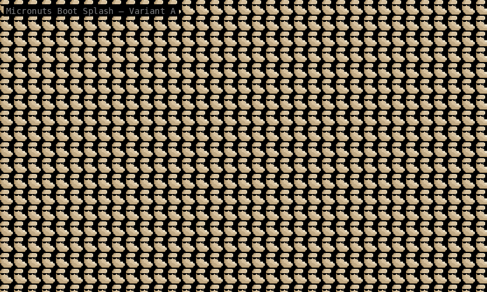
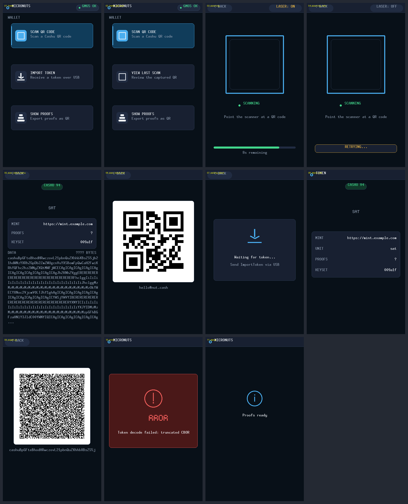

# Micronuts

**Cashu on microcontrollers — and the host stack around it.**

Micronuts is an experimental [Cashu](https://github.com/cashubtc/nuts) ecash
system: a no_std core, a backend-driven mint, a hardware wallet for the
STM32F469I-Discovery board, and a host wallet with a Slint UI that also
builds to WebAssembly as a browser demo. The device scans Cashu QR codes,
performs blind-signature operations, and talks to a host over USB CDC; the
host stack runs the full mint → send → receive → melt cycle against real
mints.

## Workspace Map

| Crate / dir | What it is |
|---|---|
| `cashu-core-lite/` | no_std + alloc Cashu core (V4 CBOR, k256): NUT-00..09/12/13 + the NUT-10 secret model, spec-quote-pinned, upstream-CDK interop + differential tests |
| `walletport/` | Offline gate validator + WalletPort facade: decode → trust → DLEQ-verify vs pinned keysets → value check → persist-before-open spent ring. Demo: `cargo run -p walletport --example gate_demo` |
| `walletport/fuzz/` | libFuzzer harness (4 targets, committed minimized corpora incl. DLEQ-valid seeds; 60M+ execs, zero panics) |
| `micronuts-app/` | Shared application core (UI state, commands, QR, UR assembler) used by firmware + simulator |
| `micronuts-mint/` | Backend-driven mint (`LightningBackend` seam, quote state machines, NUT-08 fees, NUT-09 restore, NUT-10/11/14 witness enforcement, NUT-20/29/19) — durable state, upstream settlement verified on testnut + signet; conformance 104/107; e2e-green with cashu-ts v4 |
| `micronuts-audit-adapter/` | axum JSON ⇄ CBOR-RPC bridge (13 NUT endpoints) that fronts `mint_server` for REST wallets + the conformance matrix |
| `micronuts-wallet/` | Host Cashu wallet: Slint UI (native) **and** a wasm browser build (deployed to GitHub Pages, Playwright post-deploy gate). `--demo` runs the full mint/send/receive/melt cycle |
| `micronuts-fips-bridge/` | microfips service-boundary adapter (`ServiceHandlerTransport` etc.) |
| `micronuts-fips-responder/` | Host-side FIPS responder: microfips service envelope → `CashuRpcServiceAdapter`, plus the FSP-datagram segmentation codec (`frag`) for replies above the 2048/768 B frame caps |
| `micronuts-esp32-mint/` | ESP32 esp-idf (std Rust) WiFi front-end for the mint — NVS-persisted own keyset seed; build from that dir with the `esp` toolchain (excluded from the host workspace) |
| `firmware/` | The STM32F469I board binary |
| `host-mint-tool/` | USB-CDC demo signer for the hardware wallet flow |
| `tools/hil/` | QR rig: labgrid-orchestrated HIL (CYD QR source → GM65 → F469 over CDC), `make hil-place` / `make test-qr-scanin` |

**CI (all blocking, `rust-ci.yml`):** fmt; per-package host tests (core,
mint ± upstream backend, walletport, bridges, app, wallet) + demo smoke +
feature-gate matrix; clippy `-D warnings` (host + thumb); no_std thumb
builds + firmware release build; adapter e2e (spawns mint_server + runs the
wallet `--demo` ladder); spec-quote drift vs cashubtc/nuts HEAD; cashu-ts
conformance; cargo-deny; Xtensa cross-build of `micronuts-esp32-mint` with
an anti-host-binary `file` guard. Separate workflows: fuzz-nightly,
gitleaks, boot-splash preview, and **Wallet Pages** (wasm demo deploy).
See [docs/ROADMAP.md](docs/ROADMAP.md) for what comes next,
[docs/STATUS-AND-TEST-PLAN.md](docs/STATUS-AND-TEST-PLAN.md) for the
hardware verification plan, and
[docs/QR-RIG-SESSION-PLAN-2026-09-11.md](docs/QR-RIG-SESSION-PLAN-2026-09-11.md)
for bench/HIL lore.

## Status

Three fronts, all CI-green:

- **Mint** — conformance 104/107 (0 failed; 3 runner-side skips) on the
  cashu-audit matrix; durable atomic-snapshot state; upstream settlement
  verified end-to-end against testnut (fake) and a real CLN signet node.
- **Host wallet** — native Slint app and the wasm browser demo share one
  codebase; engine + REST transport tested in CI, `--demo` ladder gates the
  adapter job. Deployed wasm playground on GitHub Pages.
- **Device** — firmware builds, flashes, and runs on the F469I-Discovery;
  blind/sign/unblind + DLEQ verification of the demo mint verified on
  silicon; USB CDC protocol hardened (split-write, garbage-flood,
  resync-within-chunk cases green); on-device animated-UR scan-in assembled
  and byte-exact under the bench QR rig.

### Boot Splash Preview



*Retro tiled Cashu nut logo grid with alternating row scrolling. See [docs/BOOT-SPLASH.md](docs/BOOT-SPLASH.md) for details.*

### App Screen Previews

Every wallet screen renders headless to PNG — no SDL2, X11, or hardware
needed. Use it for UI review loops (vision-model critique or
[scripts/visual_qa.py](scripts/visual_qa.py) pixel checks):

```bash
cargo run -p micronuts-app --example shotui --features std  # → target/shots/*.png
python3 scripts/visual_qa.py target/shots                   # edge-bleed / ink / QR checks
```



*All 11 screens: home, scanning (+progress/retry), scan result, token
info, QR mirror/export, waiting, error, status.*

## What Works

**On the device (STM32F469I-Discovery):**

- **Native simulator** — SDL2 window renders the 480×800 display on your PC;
  mouse clicks map to touch input. Develop without flashing.
- **4" DSI display** (800×480, NT35510) — boot splash, 11 app screens, QR
  mirror/export via SDRAM framebuffer + LTDC; touch wired into navigation.
- **QR scanning** — GM65 module on USART6 (silent continuous mode), single
  frames and **animated UR sequences** reassembled on-device
  (`micronuts-app/src/scanflow.rs`); scanner heal ladder over CDC.
- **USB CDC protocol** — binary command/response protocol over USB OTG FS
  (VID:PID `16c0:27dd`), incl. frame-resync and flood hardening.
- **Cashu blind signature flow** — import token, blind, sign, unblind,
  produce proofs; device DLEQ-verifies mint signatures.
- **Hardware RNG** — STM32F469 analog ring-oscillator RNG for blinder
  generation (statistical audit still pending, see #1).
- **Crypto** — secp256k1 (k256), SHA-256, hash-to-curve, CBOR V4 tokens.

**On the host:**

- **micronuts-wallet** — balance, top up via Lightning invoice, send/receive
  ecash (QR + text), pay invoices, mint management with a trust gate,
  history, seed backup; every credited proof NUT-12-verified. QR entry via
  camera (browser + desktop) or a GM65 USB-serial module (animated `ur:`
  sequences reassembled).
- **wasm browser demo** — the same UI compiled to WebAssembly with an
  embedded in-browser demo mint (no network, no persistence): a playground,
  not a wallet you keep funds in. `trunk build` in `micronuts-wallet/`, or
  use the GitHub Pages deploy (`Wallet Pages` workflow); browser e2e
  (Playwright) runs as a post-deploy gate.
- **micronuts-mint** — run `mint_server` directly (CBOR-RPC) or behind the
  audit-adapter (REST); durable state; pluggable upstream settlement.
- **Bench HIL** — the QR rig automates the whole receive-by-QR flow on
  hardware: token minted on host → CYD renders animated UR QR → GM65 scans
  → wallet reassembles + imports on device → asserted over CDC.

## Target Hardware

- **Board**: STM32F469I-Discovery (STM32F469NIH6 MCU, Cortex-M4F @ 180 MHz,
  2 MB flash, 384 KB SRAM)
- **Display**: 4" DSI LCD (NT35510 on B08; OTM8009A on B07 — B08 is what
  our bench runs)
- **Touch**: FT6X06 capacitive touch controller
- **QR Scanner**: GM65 module on USART6 (PG14/PG9 via shield-lite adapter)
- **Storage**: 16 MB SDRAM + microSD via SDIO (SDIO not yet used)
- **USB**: USB OTG FS (CDC-ACM)
- **Bench rig** (`tools/hil`): CYD ESP32 display as the QR source, GM65
  scanner, labgrid coordinator + BenchLock; ESP32 side runs on an M5 Atom
  (PICO-D4) stand-in until the D0WD is benched

## Architecture

### Host stack

```
┌────────────────────┐  REST   ┌──────────────────────┐            ┌──────────────────┐
│ micronuts-wallet   │────────▶│ micronuts-           │  CBOR-RPC  │ micronuts-mint   │
│ Slint UI           │         │ audit-adapter (axum) │◀──────────▶│ mint_server +    │
│ native + wasm      │         │ JSON ⇄ CBOR          │  subprocess│ LightningBackend │
└────────┬───────────┘         └──────────────────────┘            └────────┬─────────┘
         │ GM65 serial / camera                                            │ upstream
         ▼                                                                 ▼
      QR scan-in                                              testnut (fake) / signet CLN
```

### Device

```
┌─────────────────────────│──────────────────────────────────────────┐
│  HOST PC                │ USB CDC                                  │
│  ┌──────────────────────▼────────────────────────────────────────┐ │
│  │  host-mint-tool: demo mint signer for blinded messages        │ │
│  └───────────────────────────────────────────────────────────────┘ │
└─────────────────────────│───────────────────────────────────────────┘
┌─────────────────────────▼───────────────────────────────────────────┐
│  STM32F469I-DISCOVERY                                                │
│  ┌────────────────────────────────────────────────────────────────┐ │
│  │  micronuts-app/ (shared core: state, commands, QR/UR, UI)      │ │
│  └────────────────────────────────────────────────────────────────┘ │
│  firmware/ (HAL init, USB, display, scanner)                         │
│  cashu-core-lite/ (V4 CBOR, secp256k1, hash-to-curve)                │
└──────────────────────────────────────────────────────────────────────┘
```

The **native simulator** runs `micronuts-app` against `MockHardware`
(SDL2 display + stdin/stdout), so UI logic is identical on PC and device.

## The QR stack

- **Generation/rendering** — [`qrcodegen-no-heap`](https://crates.io/crates/qrcodegen-no-heap)
  (nayuki's QR-Code-generator, crates.io): device LCD (`micronuts-app`),
  wallet UI (`micronuts-wallet`, native + wasm — same code).
- **Scanning** — two paths:
  - **GM65 hardware**: the [Amperstrand/gm65-scanner](https://github.com/Amperstrand/gm65-scanner)
    crate — firmware driver (USART6) on the device; on the desktop wallet
    its decoder core (`ScanBuffer`, `decode_payload`, `UrDecoder`) consumes
    a USB-serial GM65 directly, animated UR included.
  - **Camera**: `rqrr` image decoding — browser wasm demo (getUserMedia,
    single-frame QRs) and desktop camera.
- **Animated UR** — `ur:bytes` multi-part framing with hash binding;
  reassembly lives on-device (`scanflow.rs`), in the wallet GM65 path, and
  in the gm65 crate's `UrDecoder`. Real tokens never fit one QR frame
  (~92 B/frame measured on the bench).

## Pinned Dependencies

Amperstrand-maintained crates (the whole maintenance surface this repo
consumes directly — publication to crates.io is tracked by #41/#42/#43):

| Crate | Pin | Source |
|-------|-----|--------|
| `gm65-scanner` | `7ee4d33` | Amperstrand original |
| `embassy-stm32f469i-disco` | `1c0dd34` | Amperstrand original BSP |

Everything else is crates.io — including the full embassy stack
(`embassy-stm32` 0.6, `embassy-executor` 0.10, `embassy-time` 0.5,
`embassy-usb` 0.6, `cortex-m` 0.7): **no forks and no `[patch.crates-io]`**
(the 2026-07 Linux-LLVM `wfe`/`sev` blocker no longer reproduces; Linux CI
builds the firmware green). Other key deps: `k256`, `sha2`, `minicbor`,
`embedded-graphics` 0.8, `qrcodegen-no-heap` 1.8, `stm32-metapac` 21,
`defmt` 1.0, `heapless`; wallet adds `slint` 1.15, `ureq` (native),
`rqrr` 0.11 + `wasm-bindgen`/`web-sys` (wasm).

## USB CDC Protocol

Binary protocol: `[Cmd:1][Len:2][Payload:N]` / `[Status:1][Len:2][Payload:N]`

| Command | Code | Description |
|---------|------|-------------|
| ImportToken | 0x01 | Send V4 token |
| GetTokenInfo | 0x02 | Request summary |
| GetBlinded | 0x03 | Request blinded outputs |
| SendSignatures | 0x04 | Send blind signatures |
| GetProofs | 0x05 | Request unblinded proofs |
| ScannerStatus | 0x10 | QR scanner connection status |
| ScannerTrigger | 0x11 | Trigger QR scan |
| ScannerData | 0x12 | Read last scanned data |
| ScannerHeal | 0x13 | Deep-sleep reboot + re-init of a wedged scanner |
| ScannerFactoryHeal | 0x14 | Factory reset + re-init (panic-safe) |

UR responses carry an assembler-outcome byte (accepted / invalid /
imported / decode-failed) so harnesses can see device state.

### Display Orientation

The panel is physically 480×800 portrait; the BSP configures LTDC + panel
scan in portrait, and `micronuts-app` uses the same dimensions, so
coordinates are identical on hardware and in the simulator. To change
orientation, swap `DisplayConfig` active width/height, change the panel
init mode, and adjust the BSP constants together — a mismatch garbles or
rotates the image.

## Quick Start

### Native simulator (SDL2)

```bash
sudo apt install libsdl2-dev
cargo run -p micronuts-app --example native_sim --features native-sim
```

No display server? Use Xvfb (`DISPLAY=:1` after starting it). NVIDIA GPU
crash? The sim auto-falls-back to `SDL_VIDEODRIVER=software` (#4).

### Host wallet + mint

```bash
# Terminal 1 — mint (adapter fronts mint_server; auto-settling FakeWallet)
cargo build -p micronuts-mint --bin mint_server
cargo run -p micronuts-audit-adapter

# Terminal 2 — wallet (480×800 window)
cargo run -p micronuts-wallet
```

First run opens on **Mints**: add `http://127.0.0.1:3030`, trust it, then
Receive (invoice or paste/scan a `cashuB…` token) / Send. Headless:
`cargo run -p micronuts-wallet --example shots` (screen PNGs) and
`cargo run -p micronuts-wallet -- --demo` (mint → send → receive → melt
ladder; point `MICRONUTS_WALLET_MINT` at any spec-conformant mint).

### wasm browser demo

```bash
cd micronuts-wallet && trunk build --release   # or `trunk serve` for dev
```

Or open the GitHub Pages deploy (`Wallet Pages` workflow). The boot console
logs `micronuts-wallet qr self-test: ok` — the in-wasm QR decoder
round-trip.

### Flash to device

**Use `st-flash`, not probe-rs, for deployment** (probe-rs halting the CPU
breaks USB CDC). After reset, the CDC device (`16c0:27dd`) appears only
once the boot splash finishes — **~60–100 s wall**; never declare
enumeration dead before ~2 min. Detect the port by VID:PID, never by tty
number. Full verified battery: `bash scripts/test_hw_swap_gate.sh`
(exit 77 = no cable). Details and hardware evidence:
[docs/HARDWARE-TEST-RESULTS-20260903.md](docs/HARDWARE-TEST-RESULTS-20260903.md).

```bash
rustup target add thumbv7em-none-eabihf
cd firmware && cargo build --release
arm-none-eabi-objcopy -O binary target/thumbv7em-none-eabihf/release/firmware firmware.bin
st-flash --connect-under-reset write firmware.bin 0x08000000
st-flash --connect-under-reset reset
```

### Bench HIL (QR rig)

Cross-project bench discipline applies: **BenchLock first**, then the
labgrid place; the F469 is shared with gm65-scanner sessions (images are
backed up and restored around every flash session).

```bash
make hil-place          # idempotent labgrid place (micronuts-qr-rig)
make test-qr-scanin     # pytest regression gate over CDC
```

Lore (splash timing, quiet cadence, ACK-leak, module degradation, heal
ladder): [docs/QR-RIG-SESSION-PLAN-2026-09-11.md](docs/QR-RIG-SESSION-PLAN-2026-09-11.md).

## Known Issues

- **RNG security audit pending** — hardware RNG works; independent entropy
  quality verification still to do (#1).
- **NVIDIA GPU SIGSEGV** in the SDL2 simulator — auto-fallback to the
  software driver, else Xvfb (#4).
- **SDIO unused** — microSD works in the BSP; firmware doesn't use it yet.
- **GM65 sustained-load degradation** (gm65 #92) — unique-content scans
  degrade under back-to-back load; campaigns pace scans and use the CDC
  heal ladder. Root-caused; crate-side fixes tracked there.
- **Funded testing** — demo keyset derives from a public seed (#56); never
  custody value with `mint_server` until keyset rotation lands.

## Roadmap

Near-term (tracked in issues; sequencing in
[docs/ROADMAP.md](docs/ROADMAP.md)):

- **Mint hardening** — keyset rotation + multiple keysets (defuses #56),
  `fee_reserve` from a real backend, async-melt poller.
- **Security findings from the FIPS gate-2 review** — #54 wallet swap
  verification, #55 decoder DoS, #57 responder peer-authz contract,
  #58 bench discipline.
- **FIPS sidecar integration (#47)** — sidecar firmware + full wallet →
  sidecar → daemon → responder e2e, gated on the #57 ADR decision.
- **Device** — NVS persistence phase 3 (#60), CSRST boot-hang bound (#61),
  first field boots of `micronuts-esp32-mint`.
- **Wallet** — animated QR emission (NUT-16), P2PK send UI, NUT-17
  websockets, camera-based animated-UR scanning, cross-mint swaps (the
  current non-goal list in `micronuts-wallet/README.md`).
- **Bench** — F4 GREEN (full scan-in ladder on a healthy module) + the
  E1–E5 rig campaigns; adopt gm65 `ScanPolicy::start_scanning` when it
  lands.
- **Upstreaming** — publish `gm65-scanner`, `nt35510`, and the BSP to
  crates.io once #43's hardware gates close (#41/#42).

Longer-term explorations: JavaCard secure-element custody (Satocash applet
over SDIO), standalone networking via the FIPS sidecar, offline P2P QR
swap between two devices, a dedicated mint signing module with
touch-confirmed signing.

## Credits

- BSP: [embassy-stm32f469i-disco](https://github.com/Amperstrand/embassy-stm32f469i-disco)
- Scanner: [gm65-scanner](https://github.com/Amperstrand/gm65-scanner)
- QR generation: [nayuki/QR-Code-generator](https://github.com/nayuki/QR-Code-generator)
- Scanner protocol reference: [specter-diy](https://github.com/cryptoadvance/specter-diy)
- Cashu protocol: [cashubtc/nuts](https://github.com/cashubtc/nuts)
- Satocash JavaCard applet: [Toporin/Satocash-Applet](https://github.com/Toporin/Satocash-Applet)

## License

[0-clause BSD license](LICENSE-0BSD.txt)
